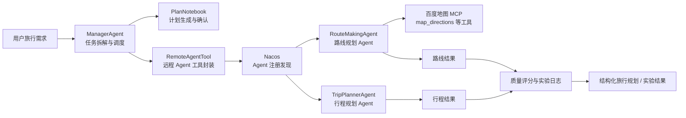

# AiTripPlan：多 Agent 旅游规划学习项目

AiTripPlan 是一个围绕“跨城自驾游规划”场景构建的多 Agent 学习与实验项目。项目把一次复杂的旅游规划请求拆分为路线规划、行程安排、住宿餐饮、预算约束和结果整合等子任务，并使用 AgentScope、A2A、Nacos、MCP、DashScope/Qwen 和百度地图 MCP 等能力验证多 Agent 协作链路。

本仓库不是一个完整商业级旅游产品，而是一个面向学习、答辩、复试、简历项目和实验复现的工程原型。它重点展示：

- 如何把“旅游规划”从单模型问答拆成多 Agent 分工协作。
- 如何用 Nacos 做远程 Agent 注册发现。
- 如何用 A2A 协议调用路线 Agent 和行程 Agent。
- 如何用 MCP 接入百度地图路线工具。
- 如何设计 Baseline、无 MCP 多 Agent、带 MCP 多 Agent 三组实验。
- 如何通过规则化评分和日志结果评估规划质量、链路成功率和响应时延。

---

## 项目简介（GitHub / 简历版）

针对传统单一大语言模型在复杂旅行规划中容易出现长链任务分解不足、外部工具调用不稳定以及多项约束难以同时满足的问题，本项目基于 **AgentScope** 与 **A2A** 设计多 Agent 协同旅行规划框架。`ManagerAgent` 使用 **ReAct** 完成需求解析、任务拆解和子任务调度；`RouteMakingAgent` 与 `TripPlannerAgent` 分别负责路线查询、日程编排和信息整合，并通过 **Skills**、Nacos 服务发现和百度地图 MCP 获得外部路线能力。

系统保留 `PlanNotebook`、Hook 执行链路和 Spring Boot 对外接口，支持观察任务分解、远程 Agent 调用和结果整合过程。地图 MCP 不可用时，路线链路会立即返回可诊断的失败原因；演示环境可显式启用预设路线或缓存路线，避免无限等待并保证完整演示。默认 `main` 分支聚焦稳定的原始多 Agent 业务链路；验证器、全局修复和局部重规划等研究性实验代码独立保存在 `research-experiment` 分支，避免混入演示主流程。

> 简历表述建议：构建基于 AgentScope、A2A、Nacos 和 MCP 的多 Agent 协同旅行规划原型，以 ReAct 驱动 Manager Agent 进行任务分解与调度，协同路线 Agent 和行程 Agent 完成复杂自驾游规划；实现地图工具调用、异常降级、结构化结果与可复现实验链路。

实验指标应以仓库中可追溯的运行日志和复评报告为准；尚未在当前冻结数据上完成独立复核的提升百分比不作为正式结论。

---

## 目录

- [项目简介（GitHub / 简历版）](#项目简介github--简历版)
- [项目定位](#项目定位)
- [整体架构](#整体架构)
- [技术栈](#技术栈)
- [仓库结构](#仓库结构)
- [核心模块](#核心模块)
- [环境要求](#环境要求)
- [配置说明](#配置说明)
- [快速启动](#快速启动)
- [实验复现](#实验复现)
- [结果解读](#结果解读)
- [常见问题](#常见问题)
- [项目边界](#项目边界)
- [后续规划](#后续规划)
- [参考资料](#参考资料)

---

## 项目定位

旅游规划并不只是让大模型生成一段攻略文本。真实的自驾游规划通常需要同时处理：

- 出发地、目的地、天数、出行日期和预算。
- 路线、里程、耗时、过路费、高速路段和交通注意事项。
- 每日景点安排、游玩节奏、住宿区域和餐饮推荐。
- 天气、停车、老人/亲子/情侣/文化/美食等偏好约束。
- 多个子结果之间的合并、校验和异常处理。

如果只用一个 LLM 直接回答，输出很容易出现路线细节不足、预算不严谨、约束遗漏、格式不稳定、无法观测中间过程等问题。AiTripPlan 的核心思路是把复杂任务交给不同职责的 Agent：

```text
用户旅行需求
  |
  v
ManagerAgent：理解需求、拆解任务、调度远程 Agent
  |
  +-- RouteMakingAgent：负责自驾路线、里程、耗时、过路费、交通建议
  |
  +-- TripPlannerAgent：负责每日行程、景点、住宿、餐饮、预算和注意事项
  |
  v
结果汇总与质量评估
```

---

## 整体架构



核心链路：

1. 用户输入旅行规划需求。
2. `ManagerAgent` 使用 ReAct + `PlanNotebook` 生成或执行计划。
3. `RemoteAgentTool` 从 Nacos 中发现远程 Agent。
4. `ManagerAgent` 通过 A2A 调用 `RouteMakingAgent` 和 `TripPlannerAgent`。
5. `RouteMakingAgent` 可通过百度地图 MCP 调用真实路线工具。
6. `TripPlannerAgent` 生成每日行程、住宿、餐饮和预算建议。
7. 实验模式下，系统把链路结果、质量评分、时延和错误信息写入 JSON/CSV/Markdown 报告。

---

## 技术栈

| 类别 | 技术 |
| --- | --- |
| 语言 | Java 17、Python、PowerShell |
| 后端框架 | Spring Boot 4.0.2 |
| Agent 框架 | AgentScope Java 1.0.8 |
| 多 Agent 通信 | A2A |
| 注册发现 | Nacos |
| 工具协议 | MCP |
| 地图能力 | 百度地图 MCP |
| 模型调用 | DashScope / Qwen，OpenAI-compatible API |
| 构建工具 | Maven |
| 实验评估 | PowerShell 批量脚本、Python 严格复评脚本 |
| 参考框架 | Spring AI Alibaba Demo、JManus / Lynxe |

---

## 仓库结构

```text
aitripplan
├── README.md
├── EXPERIMENT_README.md
├── doc
│   ├── Prompt.md
│   ├── 文档.md
│   └── 演示：Jmanus配置百度地图MCP
│
├── experiments
│   ├── README.md
│   ├── test_cases.txt
│   ├── travel_planning_testset.jsonl
│   ├── run_smoke.ps1
│   ├── run_c001_mcp_smoke.ps1
│   ├── run_experiment_v2.bat
│   ├── run_comparison_experiment.ps1
│   ├── strict_re_evaluate.py
│   └── results
│
└── code
    ├── AiTripPlan
    │   ├── AiTripPlan-AgentScope
    │   ├── WorkFlow-Agent-SpringAi 1.1
    │   └── WorkFlow-Graph-SpringAi 1.1
    │
    ├── Demo
    │   ├── SpringAi 1.0
    │   ├── SpringAi 1.1
    │   ├── SpringAi 1.1.2
    │   └── AgentScope_1.0.7
    │
    └── Jmanus_4.10.6
```

---

## 核心模块

### `code/AiTripPlan/AiTripPlan-AgentScope`

这是本仓库的主工程，包含一个 Maven 多模块项目。

```text
AiTripPlan-AgentScope
├── pom.xml
├── commons
├── manager_agent
├── routeMaking_agent
└── tripPlanner_agent
```

| 模块 | 职责 | 关键文件 |
| --- | --- | --- |
| `commons` | 公共工具模块，封装模型创建、Toolkit 注册、Nacos 客户端 | `utils/AgentUtils.java`、`utils/ToolUtils.java`、`utils/NacosUtil.java` |
| `manager_agent` | 主管 Agent，负责任务拆解、计划执行、远程 Agent 调度和实验入口 | `ManagerAgent.java`、`RemoteAgentTool.java`、`TripPlan.java`、`planHook.java` |
| `routeMaking_agent` | 路线 Agent，负责自驾路线、里程、耗时、过路费，可接入百度地图 MCP | `RouteMakingAgent.java`、`BaiduMapMCP.java` |
| `tripPlanner_agent` | 行程 Agent，负责景点、住宿、餐饮、预算和注意事项 | `TripPlannerAgent.java` |

### `manager_agent`

`ManagerAgent` 是用户入口和调度中心。它支持两种运行方式：

- 普通 ReAct 模式：让 Agent 通过工具调用远程 Agent。
- 实验模式：直接执行 Baseline、多 Agent 无 MCP、多 Agent 带 MCP 等对比实验，并输出结构化 JSON。

关键能力：

- 通过 `PlanNotebook` 做任务规划。
- 通过 `planHook` 监听计划执行过程，并支持自动确认。
- 通过 `RemoteAgentTool` 调用远程路线 Agent 和行程 Agent。
- 通过 `QualityScorer` 对路线、行程、预算、约束和内容质量打分。

### `routeMaking_agent`

`RouteMakingAgent` 负责路线规划：

- 起点、终点识别。
- 自驾路线摘要。
- 预计里程、耗时、过路费。
- 主要高速或道路。
- 交通注意事项。

默认会尝试接入百度地图 MCP。若设置 `AITRIPPLAN_DISABLE_BAIDU_MCP=true`，则关闭 MCP，路线 Agent 仅使用模型内生知识输出路线规划。

### `tripPlanner_agent`

`TripPlannerAgent` 负责行程规划：

- 每日行程。
- 景点安排。
- 住宿区域或酒店类型。
- 餐饮和地方美食。
- 预算拆分。
- 天气、安全、停车、老人/亲子等注意事项。

### `experiments`

实验目录用于验证多 Agent 架构是否比单模型直接生成更适合复杂旅游规划任务。

主要内容：

- `travel_planning_testset.jsonl`：旅行规划测试集。
- `test_cases.txt`：20 条跨城自驾游测试样本。
- `run_c001_mcp_smoke.ps1`：单条 MCP smoke test。
- `run_experiment_v2.bat`：三组实验批量运行脚本。
- `run_comparison_experiment.ps1`：Baseline 与多 Agent 对比脚本。
- `strict_re_evaluate.py`：严格复评脚本，区分工程链路成功和规划质量成功。
- `results/`：实验日志、CSV、Markdown 汇总报告。

### `WorkFlow-Graph-SpringAi 1.1`

该目录展示 Graph 工作流编排思想。它用固定流程表达旅游规划：

```text
START
  -> TaskAssignmentNode
  -> RouteMakingNode
  -> TripPlannerNode
  -> BudgetNode
  -> TotalBudgetEdge
  -> AggregationNode
  -> END
```

它适合理解 `StateGraph`、`NodeAction`、条件边、全局状态和工作流编排，但不是当前实验主链路。

### `WorkFlow-Agent-SpringAi 1.1`

该目录展示 Spring AI Alibaba Agent Framework 中的 FlowAgent 编排方式，例如：

- `SequentialAgent`
- `ParallelAgent`
- `LlmRoutingAgent`
- `ReactAgent`

### `code/Demo`

该目录保存学习型 Demo，用于分阶段理解 Spring AI Alibaba、MCP、A2A、Graph 和 AgentScope。

### `code/Jmanus_4.10.6`

JManus / Lynxe 是更完整的 Agent 应用框架参考，包含后端、前端 UI、工具系统、MCP 配置、计划模板和任务记录等能力。本仓库中它主要用于对照学习“Demo 原型”和“产品化 Agent 平台”的区别。

---

## 环境要求

推荐环境：

| 组件 | 版本或说明 |
| --- | --- |
| JDK | 17 |
| Maven | 3.8+，本机实验使用过 Maven 3.9.12 |
| Docker | 可选，用于启动 Nacos |
| Nacos | 默认服务发现地址 `localhost:8848` |
| PowerShell | Windows 下建议使用 UTF-8 编码运行脚本 |
| DashScope API Key | 必需，用于调用 Qwen 模型 |
| 百度地图 MCP SSE 地址 | 启用 MCP 路线工具时必需 |

Windows PowerShell 下建议先设置 UTF-8：

```powershell
chcp 65001
[Console]::InputEncoding = [System.Text.UTF8Encoding]::new()
[Console]::OutputEncoding = [System.Text.UTF8Encoding]::new()
$OutputEncoding = [System.Text.UTF8Encoding]::new()
```

---

## 配置说明

主工程通过环境变量读取密钥、模型和实验配置。不要把真实 API Key 写入代码或提交到 GitHub。

| 环境变量 | 是否必需 | 默认值 | 说明 |
| --- | --- | --- | --- |
| `DASHSCOPE_API_KEY` | 是 | 无 | DashScope / Qwen API Key |
| `DASHSCOPE_MODEL_NAME` | 否 | `qwen3.6-flash-2026-04-16` | 模型名称，可替换为兼容 OpenAI Chat Completions 的模型 |
| `DASHSCOPE_BASE_URL` | 否 | `https://dashscope.aliyuncs.com/compatible-mode/v1` | OpenAI-compatible base URL |
| `DASHSCOPE_MAX_TOKENS` | 否 | `700` | 单次输出 token 上限 |
| `BAIDU_MAP_MCP_SSE` | 启用 MCP 时必需 | 无 | 百度地图 MCP SSE 地址 |
| `NACOS_USERNAME` | 否 | `nacos` | Nacos 用户名 |
| `NACOS_PASSWORD` | 否 | 空 | Nacos 密码 |
| `AITRIPPLAN_PROMPT` | 否 | 内置深圳到惠州样例 | ManagerAgent 输入 prompt |
| `AITRIPPLAN_AUTO_CONFIRM` | 否 | `false` | 实验时跳过人工计划确认 |
| `AITRIPPLAN_VERIFY_REMOTE` | 否 | `false` | 普通模式结束后额外验证远程 Agent |
| `AITRIPPLAN_DISABLE_BAIDU_MCP` | 否 | `false` | 为 `true` 时路线 Agent 不加载百度地图 MCP |
| `AITRIPPLAN_EXPERIMENT_MODE` | 否 | 无 | `baseline`、`multi_no_mcp`、`multi_with_mcp` |
| `AITRIPPLAN_CASE_ID` | 否 | `unknown` | 实验样本 ID |
| `AITRIPPLAN_OUTPUT_DIR` | 否 | `experiments/results/outputs` | 实验 JSON 输出目录 |

PowerShell 示例：

```powershell
$env:DASHSCOPE_API_KEY = [Environment]::GetEnvironmentVariable('DASHSCOPE_API_KEY', 'User')
$env:BAIDU_MAP_MCP_SSE = [Environment]::GetEnvironmentVariable('BAIDU_MAP_MCP_SSE', 'User')
$env:DASHSCOPE_MODEL_NAME = 'qwen3.6-flash-2026-04-16'
$env:DASHSCOPE_BASE_URL = 'https://dashscope.aliyuncs.com/compatible-mode/v1'
$env:DASHSCOPE_MAX_TOKENS = '700'
$env:AITRIPPLAN_AUTO_CONFIRM = 'true'
```

---

## 快速启动

以下命令以 `AiTripPlan-AgentScope` 主工程为例。

### 1. 启动 Nacos

如果本地已有 Nacos，只需确保 `localhost:8848` 可访问。

也可以用 Docker 启动一个单机 Nacos：

```bash
docker run --rm --name nacos \
  -e MODE=standalone \
  -e NACOS_AUTH_ENABLE=false \
  -p 8848:8848 \
  -p 9848:9848 \
  -p 8088:8080 \
  nacos/nacos-server:v3.1.0
```

说明：

- `8848`：Nacos HTTP / 服务发现端口。
- `9848`：Nacos RPC 端口。
- `8088`：示例中映射到宿主机的 Nacos 控制台端口。

### 2. 编译主工程

```bash
cd code/AiTripPlan/AiTripPlan-AgentScope
mvn -DskipTests package
```

如果使用预览特性，建议设置：

```bash
export MAVEN_OPTS="--enable-preview -Dfile.encoding=UTF-8"
```

Windows PowerShell：

```powershell
$env:MAVEN_OPTS = '--enable-preview -Dfile.encoding=UTF-8'
```

### 3. 启动 TripPlannerAgent

```bash
mvn -f tripPlanner_agent/pom.xml -DskipTests org.springframework.boot:spring-boot-maven-plugin:4.0.2:run
```

成功后默认监听：

```text
http://localhost:8085
```

并注册 `TripPlannerAgent` 到 Nacos。

### 4. 启动 RouteMakingAgent

启用百度地图 MCP：

```bash
mvn -f routeMaking_agent/pom.xml -DskipTests org.springframework.boot:spring-boot-maven-plugin:4.0.2:run
```

如果只是验证多 Agent 链路，暂时不接百度地图 MCP：

```bash
export AITRIPPLAN_DISABLE_BAIDU_MCP=true
mvn -f routeMaking_agent/pom.xml -DskipTests org.springframework.boot:spring-boot-maven-plugin:4.0.2:run
```

Windows PowerShell：

```powershell
$env:AITRIPPLAN_DISABLE_BAIDU_MCP = 'true'
mvn -f routeMaking_agent/pom.xml -DskipTests org.springframework.boot:spring-boot-maven-plugin:4.0.2:run
```

成功后默认监听：

```text
http://localhost:8082
```

并注册 `RouteMakingAgent` 到 Nacos。

### 5. 运行 ManagerAgent

```bash
export AITRIPPLAN_PROMPT="帮我规划 2026 年春节从广州到厦门的 4 日自驾游，要求包含路线、每天景点安排、住宿区域、餐饮推荐、预算控制在 3000 元以内。"

mvn -f manager_agent/pom.xml -DskipTests exec:java \
  -Dexec.mainClass=managerAgent.ManagerAgentApplication \
  -Dexec.jvmArgs="--enable-preview -Dfile.encoding=UTF-8"
```

Windows PowerShell：

```powershell
$env:AITRIPPLAN_PROMPT = '帮我规划 2026 年春节从广州到厦门的 4 日自驾游，要求包含路线、每天景点安排、住宿区域、餐饮推荐、预算控制在 3000 元以内。'

mvn -f manager_agent/pom.xml -DskipTests exec:java `
  '-Dexec.mainClass=managerAgent.ManagerAgentApplication' `
  '-Dexec.jvmArgs=--enable-preview -Dfile.encoding=UTF-8'
```

成功输出通常会包含：

```text
#### User Prompt ####
RouteMakingAgent 响应:
TripPlannerAgent 响应:
```

---

## 实验复现

### 实验分组

| 组别 | 模式 | 说明 |
| --- | --- | --- |
| Group A | `baseline` | 单模型直接生成完整旅行规划，不调用远程 Agent |
| Group B | `multi_no_mcp` | ManagerAgent 调度路线 Agent 和行程 Agent，路线 Agent 不接地图 MCP |
| Group C | `multi_with_mcp` | ManagerAgent 调度路线 Agent 和行程 Agent，路线 Agent 接入百度地图 MCP |

注意：`AITRIPPLAN_EXPERIMENT_MODE` 负责 ManagerAgent 的实验输出模式；百度地图 MCP 是否实际启用，取决于 `RouteMakingAgent` 启动时的 `AITRIPPLAN_DISABLE_BAIDU_MCP`。

### 单条 MCP Smoke Test

```powershell
powershell -ExecutionPolicy Bypass -File experiments/run_c001_mcp_smoke.ps1
```

该脚本会运行 C001 样本，并尝试使用 `multi_with_mcp` 模式输出 JSON。

### 批量对比实验

```powershell
powershell -ExecutionPolicy Bypass -File experiments/run_comparison_experiment.ps1
```

常用参数：

```powershell
powershell -ExecutionPolicy Bypass -File experiments/run_comparison_experiment.ps1 -Start 1 -Limit 20
powershell -ExecutionPolicy Bypass -File experiments/run_comparison_experiment.ps1 -BaselineOnly
powershell -ExecutionPolicy Bypass -File experiments/run_comparison_experiment.ps1 -MultiAgentOnly
```

### 严格复评

```bash
python experiments/strict_re_evaluate.py
```

输出：

```text
experiments/results/strict_baseline_vs_group_c_details.csv
experiments/results/strict_baseline_vs_group_c_summary.md
```

### 实验输出目录

```text
experiments/results
├── baseline_logs
├── multi_agent_logs
├── outputs
├── aitripplan_comparison_results.csv
├── strict_baseline_vs_group_c_details.csv
├── strict_baseline_vs_group_c_summary.md
└── experiment_summary.md
```

---

## 结果解读

当前仓库中已经保存了实验结果。严格复评报告见：

```text
experiments/results/strict_baseline_vs_group_c_summary.md
```

该复评把“工程链路成功率”和“规划质量成功率”分开统计，并对 Multi-Agent + MCP 额外要求：

- `MCP_CALL_STATUS: success`
- `USED_TOOLS: map_directions`

示例复评结果：

| 方法 | 链路完成率 | 路线规划成功率 | 行程规划成功率 | 预算满足率 | 约束满足率 | 最终质量成功率 | 平均时延 |
| --- | ---: | ---: | ---: | ---: | ---: | ---: | ---: |
| Baseline 单模型 | 100.0% | 20.0% | 85.0% | 40.0% | 70.0% | 15.0% | 8.0s |
| Multi-Agent 无 MCP | 100.0% | 65.0% | 90.0% | 100.0% | 55.0% | 50.0% | 38.6s |
| Multi-Agent + 百度地图 MCP | 100.0% | 70.0% | 95.0% | 90.0% | 55.0% | 55.0% | 62.5s |

可以支撑的结论：

- 多 Agent 链路可以稳定完成 Nacos 服务发现和 A2A 远程调用。
- 多 Agent 相比单模型在路线规划、行程规划、预算覆盖和最终质量成功率上有提升。
- 引入远程 Agent 和 MCP 会明显增加响应时延。
- 当前质量评估仍是规则化评估，不等同于人工专家评分。

不应夸大的结论：

- 不能说系统已经是生产级旅游规划产品。
- 不能只看链路成功率，必须同时看内容质量成功率。
- 不能忽略多 Agent 和 MCP 带来的额外时延。

---

## 常见问题

### 1. `Missing required environment variable: DASHSCOPE_API_KEY`

说明模型 API Key 没有设置。请在系统环境变量或当前 shell 中设置：

```powershell
$env:DASHSCOPE_API_KEY = '你的 DashScope API Key'
```

不要把真实 Key 写进 Java 文件、README 或实验报告。

### 2. `Missing required environment variable: BAIDU_MAP_MCP_SSE`

说明 `RouteMakingAgent` 正在尝试加载百度地图 MCP，但没有配置 MCP SSE 地址。

解决方式：

```powershell
$env:BAIDU_MAP_MCP_SSE = '你的百度地图 MCP SSE 地址'
```

如果暂时只验证多 Agent 链路，可以关闭 MCP：

```powershell
$env:AITRIPPLAN_DISABLE_BAIDU_MCP = 'true'
```

### 3. Nacos 无法发现 Agent

检查：

```powershell
netstat -ano | Select-String ':8848'
```

并确认：

- Nacos 已启动。
- `routeMaking_agent` 和 `tripPlanner_agent` 已启动。
- 两个 Agent 日志中出现注册成功信息。
- `NACOS_USERNAME` 和 `NACOS_PASSWORD` 与 Nacos 配置一致。

### 4. 端口冲突

默认端口：

| 服务 | 端口 |
| --- | ---: |
| ManagerAgent | 8081 |
| RouteMakingAgent | 8082 |
| TripPlannerAgent | 8085 |
| Nacos | 8848 |

如果端口被占用，请修改对应模块的 `src/main/resources/application.yml`。

### 5. 中文日志乱码

Windows 下先执行 UTF-8 设置：

```powershell
chcp 65001
[Console]::InputEncoding = [System.Text.UTF8Encoding]::new()
[Console]::OutputEncoding = [System.Text.UTF8Encoding]::new()
$OutputEncoding = [System.Text.UTF8Encoding]::new()
```

运行 Maven 时增加：

```powershell
$env:MAVEN_OPTS = '--enable-preview -Dfile.encoding=UTF-8'
```

### 6. Maven 退出时出现 Nacos 线程 warning

如果业务日志已经包含 `RouteMakingAgent 响应` 和 `TripPlannerAgent 响应`，且 Maven 输出 `BUILD SUCCESS`，退出阶段的 Nacos 线程 warning 不一定代表业务失败。实验脚本会单独记录链路成功、内容质量和错误信息。

---

## 项目边界

当前项目已经体现：

- 多 Agent 角色分工。
- ReActAgent。
- PlanNotebook。
- A2A 远程 Agent 调用。
- Nacos Agent 注册发现。
- MCP 工具接入。
- 百度地图 MCP 路线工具调用。
- Hook 执行过程监听。
- Baseline / 多 Agent / 多 Agent + MCP 实验设计。
- 规则化质量评分与严格复评脚本。

当前项目尚未完整覆盖：

- 面向用户的完整旅游规划前端产品。
- 持久化 Memory。
- RAG 知识库检索。
- 更强的异常恢复和重试策略。
- 人工专家评审体系。
- 生产级鉴权、限流、灰度、监控和压测。
- 完整的酒店、门票、天气、实时交通和价格查询闭环。

在答辩或简历中建议把它描述为“多 Agent 旅游规划原型和实验系统”，不要描述为已经上线的商业系统。

---

## 后续规划

可继续优化的方向：

- 将真实 API Key 和 MCP 地址全部迁移到环境变量或安全配置中心。
- 为 `ManagerAgent` 增加 HTTP API，支持外部系统直接提交 prompt。
- 为路线、行程、预算输出定义统一 JSON Schema。
- 增加 Reviewer Agent，对最终计划做约束校验和风险提示。
- 增加天气、酒店、景区开放时间、门票价格等 MCP 工具。
- 增加更大规模测试集和人工复评样本。
- 对比更多模型、不同 token 上限和不同任务分解策略。
- 将实验结果接入可视化 Dashboard。

---

## 适合简历的一句话

构建基于 AgentScope、A2A、Nacos 和 MCP 的多 Agent 协同旅游规划原型，将复杂自驾游需求拆分为主管调度、路线规划和行程规划三个 Agent，并基于 20 条跨城自驾游样本对单模型 Baseline、多 Agent 无 MCP、多 Agent + 百度地图 MCP 三组方案进行对比评估，量化分析路线规划、行程规划、预算满足、约束覆盖和响应时延。

---

## GitHub 发布前注意

发布到 GitHub 前请确认：

- 没有提交真实 `DASHSCOPE_API_KEY`。
- 没有提交真实 `BAIDU_MAP_MCP_SSE` 私有地址。
- 没有提交包含密钥、账号或个人隐私的日志。
- 实验结果中的绝对路径仅用于本地复现，不作为跨机器运行前提。
- README 中的结果表述与 `experiments/results` 中的实际报告保持一致。

---

## 参考资料

- Spring AI Alibaba 文档：https://java2ai.com/
- AgentScope Java 文档：https://java.agentscope.io/zh/intro.html
- ModelScope MCP 广场：https://modelscope.cn/mcp
- 百度地图开放平台：https://lbs.baidu.com/
- JManus / Lynxe：https://github.com/spring-ai-alibaba/Lynxe
