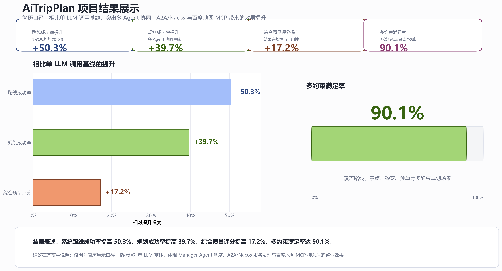
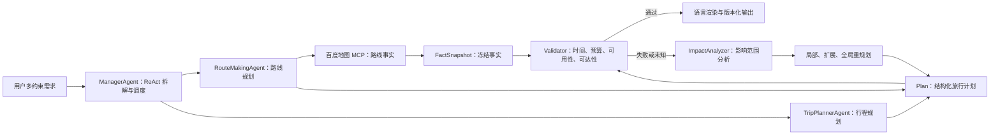
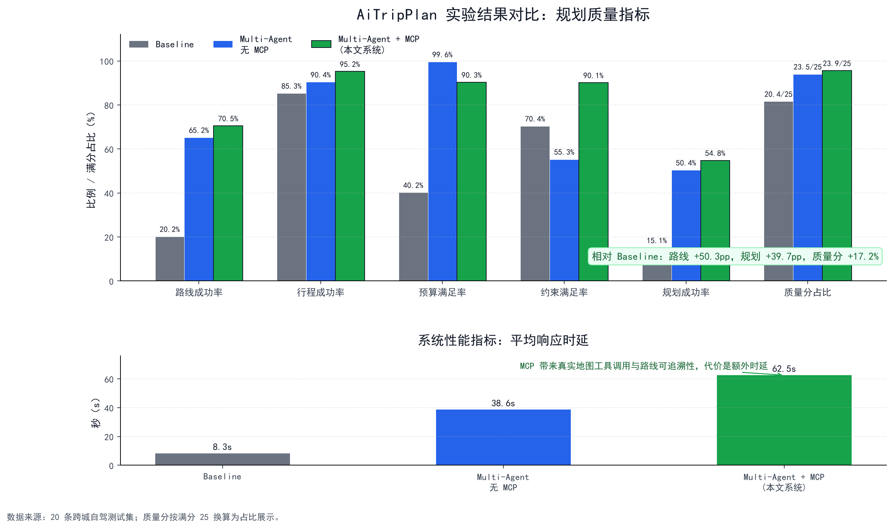

# AiTripPlan：面向旅行规划的可验证在线神经符号 Multi-Agent 框架

AiTripPlan 面向跨城自驾游的多约束规划场景，基于 AgentScope 与 A2A 构建 Multi-Agent 协作框架。`ManagerAgent` 通过 ReAct 完成需求理解、任务拆解与远程调度；`RouteMakingAgent` 借助百度地图 MCP 获取可追溯的路线事实；`TripPlannerAgent` 负责每日景点、住宿、餐饮与预算安排。

系统不仅生成自然语言攻略，还将结果组织为结构化 `Plan`，把地图路线和资源状态固化为 `FactSnapshot`，再由独立的时间、预算、可用性与路线可达性 Validator 校验硬约束。当事实或用户约束发生变化时，系统通过依赖图定位影响范围，并按“局部修补 → 扩展修补 → 全局重规划”逐级处理，最终由主 Agent 完成语言渲染与版本化输出。

> 本仓库是面向学习、研究、答辩与实验复现的工程原型，不是已经上线的商业旅游产品。

## 核心亮点

- **多 Agent 协作**：Nacos 负责服务注册发现，A2A 负责远程 Agent 调用，ManagerAgent 统一拆解与汇总任务。
- **工具事实落地**：路线 Agent 通过百度地图 MCP 获取路线、距离、耗时等事实，降低模型凭空生成路线数据的风险。
- **神经符号校验**：LLM 负责理解、生成与修复，Java 确定性 Validator 负责时间、预算、资源可用性和路线连续性校验。
- **在线增量重规划**：基于 `DependencyGraph` 与 `ImpactAnalyzer` 缩小变更影响范围，优先局部修复，失败后再升级到全局重规划。
- **可复现实验**：提供单 LLM Baseline、多 Agent 无 MCP、多 Agent + MCP 三组实验，以及 JSON、CSV、日志和绘图脚本。

### 实验结果摘要

在仓库保存的 20 条跨城自驾游测试集汇总口径下，相比单 LLM Baseline：

| 路线成功率 | 规划成功率 | 综合质量评分 | 多约束满足率 |
| ---: | ---: | ---: | ---: |
| **+50.3 个百分点** | **+39.7 个百分点** | **+17.2%（相对提升）** | **90.1%** |



> 指标来自仓库内的实验汇总与绘图数据；样本规模较小，且质量指标为规则化评估，结果用于工程对比，不等同于生产环境效果或人工专家评审。

---

## 目录

- [核心亮点](#核心亮点)
- [项目定位](#项目定位)
- [整体架构](#整体架构)
- [技术栈](#技术栈)
- [仓库结构](#仓库结构)
- [核心模块](#核心模块)
- [可验证在线重规划](#可验证在线重规划)
- [环境要求](#环境要求)
- [配置说明](#配置说明)
- [快速启动](#快速启动)
- [实验复现](#实验复现)
- [结果解读](#结果解读)
- [常见问题](#常见问题)
- [项目边界](#项目边界)
- [后续规划](#后续规划)
- [参考资料](#参考资料)

---

## 项目定位

旅游规划并不只是让大模型生成一段攻略文本。真实的自驾游规划通常需要同时处理：

- 出发地、目的地、天数、出行日期和预算。
- 路线、里程、耗时、过路费、高速路段和交通注意事项。
- 每日景点安排、游玩节奏、住宿区域和餐饮推荐。
- 天气、停车、老人/亲子/情侣/文化/美食等偏好约束。
- 多个子结果之间的合并、硬约束校验、事实变化和异常处理。

如果只用一个 LLM 直接回答，输出很容易出现路线细节不足、预算不严谨、约束遗漏、格式不稳定和中间过程不可验证等问题。AiTripPlan 将生成能力与确定性校验结合，把复杂任务交给不同职责的 Agent，并在输出前建立一条可审计的验证链路：

```text
用户旅行需求
  |
  v
ManagerAgent：理解需求、拆解任务、调度远程 Agent
  |
  +-- RouteMakingAgent：负责自驾路线、里程、耗时、过路费、交通建议
  |
  +-- TripPlannerAgent：负责每日行程、景点、住宿、餐饮、预算和注意事项
  |
  v
结构化 Plan + 冻结的 FactSnapshot
  |
  v
Time / Budget / Availability / Reachability Validator
  |
  +-- 通过：版本化保存并渲染最终结果
  |
  +-- 失败或事实变化：局部修补 -> 扩展修补 -> 全局重规划
```

---

## 整体架构



核心链路：

1. 用户输入旅行规划需求。
2. `ManagerAgent` 使用 ReAct 与 `PlanNotebook` 拆解任务，并通过 Nacos 发现远程 Agent。
3. `RemoteAgentTool` 基于 A2A 调用 `RouteMakingAgent` 和 `TripPlannerAgent`。
4. 路线 Agent 通过百度地图 MCP 获取真实路线事实，行程 Agent 生成每日安排与预算建议。
5. 系统把候选结果转换为结构化 `Plan`，并使用冻结的 `FactSnapshot` 保证同一次验证中的事实一致。
6. 四类确定性 Validator 给出 `VERIFIED`、`UNVERIFIED` 或 `INVALID` 状态及可审计证据。
7. 遇到变化或冲突时，`ImpactAnalyzer` 定位受影响节点，重规划协调器按局部、扩展、全局三级策略修复。
8. 系统保存计划版本与差异，并在实验模式下输出 JSON、CSV、Markdown 报告和时延指标。

---

## 技术栈

| 类别 | 技术 |
| --- | --- |
| 语言 | Java 17、Python、PowerShell |
| 后端框架 | Spring Boot 4.0.2 |
| Agent 框架 | AgentScope Java 1.0.8 |
| 多 Agent 通信 | A2A |
| 注册发现 | Nacos |
| 工具协议 | MCP |
| 地图能力 | 百度地图 MCP |
| 模型调用 | Mimo v2.5，OpenAI-compatible API |
| 结构化契约 | JSON Schema、Plan、PlanVersion、FactSnapshot |
| 符号校验 | Java 确定性 Validator（时间、预算、可用性、可达性） |
| 在线重规划 | DependencyGraph、ImpactAnalyzer、LocalReplanner、GlobalReplanner |
| 构建工具 | Maven |
| 实验评估 | PowerShell 批量脚本、Python 严格复评脚本 |
| 参考框架 | Spring AI Alibaba Demo、JManus / Lynxe |

---

## 仓库结构

```text
aitripplan
├── README.md
├── EXPERIMENT_README.md
├── doc
│   ├── Prompt.md
│   ├── 文档.md
│   └── 演示：Jmanus配置百度地图MCP
│
├── experiments
│   ├── README.md
│   ├── test_cases.txt
│   ├── travel_planning_testset.jsonl
│   ├── run_smoke.ps1
│   ├── run_c001_mcp_smoke.ps1
│   ├── run_experiment_v2.bat
│   ├── run_comparison_experiment.ps1
│   ├── strict_re_evaluate.py
│   └── results
│
└── code
    ├── AiTripPlan
    │   ├── AiTripPlan-AgentScope
    │   │   ├── commons
    │   │   ├── manager_agent
    │   │   ├── routeMaking_agent
    │   │   └── tripPlanner_agent
    │   ├── WorkFlow-Agent-SpringAi 1.1
    │   └── WorkFlow-Graph-SpringAi 1.1
    │
    ├── Demo
    │   ├── SpringAi 1.0
    │   ├── SpringAi 1.1
    │   ├── SpringAi 1.1.2
    │   └── AgentScope_1.0.7
    │
    └── Jmanus_4.10.6
```

---

## 核心模块

### `code/AiTripPlan/AiTripPlan-AgentScope`

这是本仓库的主工程，包含一个 Maven 多模块项目。

```text
AiTripPlan-AgentScope
├── pom.xml
├── commons
├── manager_agent
├── routeMaking_agent
└── tripPlanner_agent
```

| 模块 | 职责 | 关键文件 |
| --- | --- | --- |
| `commons` | 公共工具与领域模型，封装模型创建、Nacos 客户端、Plan、FactSnapshot 和 ChangeEvent | `AgentUtils.java`、`NacosUtil.java`、`Plan.java`、`FactSnapshot.java` |
| `manager_agent` | 主管 Agent，负责任务拆解、远程调度、结构化计划、确定性校验、在线重规划和实验入口 | `ManagerAgent.java`、`RemoteAgentTool.java`、`PlanValidationService.java`、`ThreeLevelReplanner.java` |
| `routeMaking_agent` | 路线 Agent，负责自驾路线、里程、耗时、过路费，可接入百度地图 MCP | `RouteMakingAgent.java`、`BaiduMapMCP.java` |
| `tripPlanner_agent` | 行程 Agent，负责景点、住宿、餐饮、预算和注意事项 | `TripPlannerAgent.java` |

### `manager_agent`

`ManagerAgent` 是用户入口和调度中心。它支持两种运行方式：

- 普通 ReAct 模式：让 Agent 通过工具调用远程 Agent。
- 实验模式：直接执行 Baseline、多 Agent 无 MCP、多 Agent 带 MCP 等对比实验，并输出结构化 JSON。

关键能力：

- 通过 `PlanNotebook` 做任务规划。
- 通过 `planHook` 监听计划执行过程，并支持自动确认。
- 通过 `RemoteAgentTool` 调用远程路线 Agent 和行程 Agent。
- 通过 JSON Schema 将模型输出解析为结构化 `Plan`。
- 通过 `PlanVersionService` 追加式保存计划版本、事实快照和变更事件。
- 通过四类确定性 Validator 输出可审计的约束证据。
- 通过影响范围分析和三级升级策略处理在线重规划。
- 通过 `QualityScorer` 对路线、行程、预算、约束和内容质量打分。

### `routeMaking_agent`

`RouteMakingAgent` 负责路线规划：

- 起点、终点识别。
- 自驾路线摘要。
- 预计里程、耗时、过路费。
- 主要高速或道路。
- 交通注意事项。

默认会尝试接入百度地图 MCP。若设置 `AITRIPPLAN_DISABLE_BAIDU_MCP=true`，则关闭 MCP，路线 Agent 仅使用模型内生知识输出路线规划。

### `tripPlanner_agent`

`TripPlannerAgent` 负责行程规划：

- 每日行程。
- 景点安排。
- 住宿区域或酒店类型。
- 餐饮和地方美食。
- 预算拆分。
- 天气、安全、停车、老人/亲子等注意事项。

### `experiments`

实验目录用于验证多 Agent 架构是否比单模型直接生成更适合复杂旅游规划任务。

主要内容：

- `travel_planning_testset.jsonl`：旅行规划测试集。
- `test_cases.txt`：20 条跨城自驾游测试样本。
- `run_c001_mcp_smoke.ps1`：单条 MCP smoke test。
- `run_experiment_v2.bat`：三组实验批量运行脚本。
- `run_comparison_experiment.ps1`：Baseline 与多 Agent 对比脚本。
- `strict_re_evaluate.py`：严格复评脚本，区分工程链路成功和规划质量成功。
- `results/`：实验日志、CSV、Markdown 汇总报告。

### `WorkFlow-Graph-SpringAi 1.1`

该目录展示 Graph 工作流编排思想。它用固定流程表达旅游规划：

```text
START
  -> TaskAssignmentNode
  -> RouteMakingNode
  -> TripPlannerNode
  -> BudgetNode
  -> TotalBudgetEdge
  -> AggregationNode
  -> END
```

它适合理解 `StateGraph`、`NodeAction`、条件边、全局状态和工作流编排，但不是当前实验主链路。

### `WorkFlow-Agent-SpringAi 1.1`

该目录展示 Spring AI Alibaba Agent Framework 中的 FlowAgent 编排方式，例如：

- `SequentialAgent`
- `ParallelAgent`
- `LlmRoutingAgent`
- `ReactAgent`

### `code/Demo`

该目录保存学习型 Demo，用于分阶段理解 Spring AI Alibaba、MCP、A2A、Graph 和 AgentScope。

### `code/Jmanus_4.10.6`

JManus / Lynxe 是更完整的 Agent 应用框架参考，包含后端、前端 UI、工具系统、MCP 配置、计划模板和任务记录等能力。本仓库中它主要用于对照学习“Demo 原型”和“产品化 Agent 平台”的区别。

---

## 可验证在线重规划

### 结构化中间态

- `Plan`：包含日期、节点、时间、地点、费用、交通方式和用户约束。
- `FactSnapshot`：保存当前验证所依赖的路线、开放状态和资源事实，避免验证过程中使用变化中的在线数据。
- `PlanVersion`：以追加方式保存父子版本、变更事件与对应快照，不覆盖历史计划。

### 确定性校验

| Validator | 校验内容 | 典型失败 |
| --- | --- | --- |
| `TimeValidator` | 节点起止时间与用户时间约束 | 时间重叠、超出可用时间 |
| `BudgetValidator` | 总费用与预算上限 | 预算超支、费用字段缺失 |
| `AvailabilityValidator` | 景点、酒店、交通资源状态 | 景点关闭、酒店不可用、营业时间冲突 |
| `ReachabilityValidator` | 相邻节点间路线耗时与可达性 | 路线事实缺失、通勤时间超过行程间隔 |

聚合规则为：任一校验 `FAIL` 则计划为 `INVALID`；没有失败但存在 `UNKNOWN` 则为 `UNVERIFIED`；全部通过才是 `VERIFIED`。每条结果同时保留相关节点、约束、事实来源、计算过程和解释。

### 三级重规划

1. **局部修补**：仅允许修改直接受影响的 A0 节点。
2. **扩展修补**：放宽到依赖图传播得到的 A0、A1、A2 节点集合。
3. **全局重规划**：前两级无法消除硬约束冲突时，重新生成完整计划。

每一级候选结果都必须重新经过 Schema 和 Validator 校验；没有合法候选、越权修改或产生新硬约束冲突时，系统按确定性策略升级到下一级。

---

## 环境要求

推荐环境：

| 组件 | 版本或说明 |
| --- | --- |
| JDK | 17 |
| Maven | 3.8+，本机实验使用过 Maven 3.9.12 |
| Docker | 可选，用于启动 Nacos |
| Nacos | 默认服务发现地址 `localhost:8848` |
| PowerShell | Windows 下建议使用 UTF-8 编码运行脚本 |
| Mimo API Key | 必需，用于调用 Mimo 模型 |
| 百度地图 MCP SSE 地址 | 启用 MCP 路线工具时必需 |

Windows PowerShell 下建议先设置 UTF-8：

```powershell
chcp 65001
[Console]::InputEncoding = [System.Text.UTF8Encoding]::new()
[Console]::OutputEncoding = [System.Text.UTF8Encoding]::new()
$OutputEncoding = [System.Text.UTF8Encoding]::new()
```

---

## 配置说明

主工程通过环境变量读取密钥、模型和实验配置。不要把真实 API Key 写入代码或提交到 GitHub。

| 环境变量 | 是否必需 | 默认值 | 说明 |
| --- | --- | --- | --- |
| `MIMO_API_KEY` | 是 | 无 | 小米 Mimo API Key（仅服务端使用） |
| `MIMO_MODEL_NAME` | 否 | `mimo-v2.5` | 使用的 Mimo 模型名称 |
| `MIMO_BASE_URL` | 否 | `https://api.xiaomimimo.com/v1` | Mimo OpenAI 兼容 API 地址 |
| `MIMO_MAX_TOKENS` | 否 | `700` | 单次输出 token 上限 |
| `BAIDU_MAP_MCP_SSE` | 启用 MCP 时必需 | 无 | 百度地图 MCP SSE 地址 |
| `NACOS_USERNAME` | 否 | `nacos` | Nacos 用户名 |
| `NACOS_PASSWORD` | 否 | 空 | Nacos 密码 |
| `AITRIPPLAN_PROMPT` | 否 | 内置深圳到惠州样例 | ManagerAgent 输入 prompt |
| `AITRIPPLAN_AUTO_CONFIRM` | 否 | `false` | 实验时跳过人工计划确认 |
| `AITRIPPLAN_VERIFY_REMOTE` | 否 | `false` | 普通模式结束后额外验证远程 Agent |
| `AITRIPPLAN_DISABLE_BAIDU_MCP` | 否 | `false` | 为 `true` 时路线 Agent 不加载百度地图 MCP |
| `AITRIPPLAN_EXPERIMENT_MODE` | 否 | 无 | `baseline`、`multi_no_mcp`、`multi_with_mcp` |
| `AITRIPPLAN_CASE_ID` | 否 | `unknown` | 实验样本 ID |
| `AITRIPPLAN_OUTPUT_DIR` | 否 | `experiments/results/outputs` | 实验 JSON 输出目录 |

PowerShell 示例：

```powershell
$env:MIMO_API_KEY = [Environment]::GetEnvironmentVariable('MIMO_API_KEY', 'User')
$env:BAIDU_MAP_MCP_SSE = [Environment]::GetEnvironmentVariable('BAIDU_MAP_MCP_SSE', 'User')
$env:MIMO_MODEL_NAME = 'mimo-v2.5'
$env:MIMO_BASE_URL = 'https://api.xiaomimimo.com/v1'
$env:MIMO_MAX_TOKENS = '700'
$env:AITRIPPLAN_AUTO_CONFIRM = 'true'
```

---

## 快速启动

以下命令以 `AiTripPlan-AgentScope` 主工程为例。

### 1. 启动 Nacos

如果本地已有 Nacos，只需确保 `localhost:8848` 可访问。

也可以用 Docker 启动一个单机 Nacos：

```bash
docker run --rm --name nacos \
  -e MODE=standalone \
  -e NACOS_AUTH_ENABLE=false \
  -p 8848:8848 \
  -p 9848:9848 \
  -p 8088:8080 \
  nacos/nacos-server:v3.1.0
```

说明：

- `8848`：Nacos HTTP / 服务发现端口。
- `9848`：Nacos RPC 端口。
- `8088`：示例中映射到宿主机的 Nacos 控制台端口。

### 2. 编译主工程

```bash
cd code/AiTripPlan/AiTripPlan-AgentScope
mvn -DskipTests package
```

如果使用预览特性，建议设置：

```bash
export MAVEN_OPTS="--enable-preview -Dfile.encoding=UTF-8"
```

Windows PowerShell：

```powershell
$env:MAVEN_OPTS = '--enable-preview -Dfile.encoding=UTF-8'
```

### 3. 启动 TripPlannerAgent

```bash
mvn -f tripPlanner_agent/pom.xml -DskipTests org.springframework.boot:spring-boot-maven-plugin:4.0.2:run
```

成功后默认监听：

```text
http://localhost:8085
```

并注册 `TripPlannerAgent` 到 Nacos。

### 4. 启动 RouteMakingAgent

启用百度地图 MCP：

```bash
mvn -f routeMaking_agent/pom.xml -DskipTests org.springframework.boot:spring-boot-maven-plugin:4.0.2:run
```

如果只是验证多 Agent 链路，暂时不接百度地图 MCP：

```bash
export AITRIPPLAN_DISABLE_BAIDU_MCP=true
mvn -f routeMaking_agent/pom.xml -DskipTests org.springframework.boot:spring-boot-maven-plugin:4.0.2:run
```

Windows PowerShell：

```powershell
$env:AITRIPPLAN_DISABLE_BAIDU_MCP = 'true'
mvn -f routeMaking_agent/pom.xml -DskipTests org.springframework.boot:spring-boot-maven-plugin:4.0.2:run
```

成功后默认监听：

```text
http://localhost:8082
```

并注册 `RouteMakingAgent` 到 Nacos。

### 5. 运行 ManagerAgent

```bash
export AITRIPPLAN_PROMPT="帮我规划 2026 年春节从广州到厦门的 4 日自驾游，要求包含路线、每天景点安排、住宿区域、餐饮推荐、预算控制在 3000 元以内。"

mvn -f manager_agent/pom.xml -DskipTests exec:java \
  -Dexec.mainClass=managerAgent.ManagerAgentApplication \
  -Dexec.jvmArgs="--enable-preview -Dfile.encoding=UTF-8"
```

Windows PowerShell：

```powershell
$env:AITRIPPLAN_PROMPT = '帮我规划 2026 年春节从广州到厦门的 4 日自驾游，要求包含路线、每天景点安排、住宿区域、餐饮推荐、预算控制在 3000 元以内。'

mvn -f manager_agent/pom.xml -DskipTests exec:java `
  '-Dexec.mainClass=managerAgent.ManagerAgentApplication' `
  '-Dexec.jvmArgs=--enable-preview -Dfile.encoding=UTF-8'
```

成功输出通常会包含：

```text
#### User Prompt ####
RouteMakingAgent 响应:
TripPlannerAgent 响应:
```

---

## 实验复现

### 实验分组

| 组别 | 模式 | 说明 |
| --- | --- | --- |
| Group A | `baseline` | 单模型直接生成完整旅行规划，不调用远程 Agent |
| Group B | `multi_no_mcp` | ManagerAgent 调度路线 Agent 和行程 Agent，路线 Agent 不接地图 MCP |
| Group C | `multi_with_mcp` | ManagerAgent 调度路线 Agent 和行程 Agent，路线 Agent 接入百度地图 MCP |

注意：`AITRIPPLAN_EXPERIMENT_MODE` 负责 ManagerAgent 的实验输出模式；百度地图 MCP 是否实际启用，取决于 `RouteMakingAgent` 启动时的 `AITRIPPLAN_DISABLE_BAIDU_MCP`。

### 单条 MCP Smoke Test

```powershell
powershell -ExecutionPolicy Bypass -File experiments/run_c001_mcp_smoke.ps1
```

该脚本会运行 C001 样本，并尝试使用 `multi_with_mcp` 模式输出 JSON。

### 批量对比实验

```powershell
powershell -ExecutionPolicy Bypass -File experiments/run_comparison_experiment.ps1
```

常用参数：

```powershell
powershell -ExecutionPolicy Bypass -File experiments/run_comparison_experiment.ps1 -Start 1 -Limit 20
powershell -ExecutionPolicy Bypass -File experiments/run_comparison_experiment.ps1 -BaselineOnly
powershell -ExecutionPolicy Bypass -File experiments/run_comparison_experiment.ps1 -MultiAgentOnly
```

### 严格复评

```bash
python experiments/strict_re_evaluate.py
```

输出：

```text
experiments/results/strict_baseline_vs_group_c_details.csv
experiments/results/strict_baseline_vs_group_c_summary.md
```

### 实验输出目录

```text
experiments/results
├── baseline_logs
├── multi_agent_logs
├── outputs
├── aitripplan_comparison_results.csv
├── strict_baseline_vs_group_c_details.csv
├── strict_baseline_vs_group_c_summary.md
└── experiment_summary.md
```

---

## 结果解读

当前展示口径使用仓库绘图脚本中的 20 条跨城自驾游测试集汇总数据。评估将“工程链路成功”和“规划质量成功”分开统计，并对 Multi-Agent + MCP 额外要求：

- `MCP_CALL_STATUS: success`
- `USED_TOOLS: map_directions`

| 方法 | 路线成功率 | 行程成功率 | 预算满足率 | 约束满足率 | 规划成功率 | 平均质量分 | 平均时延 |
| --- | ---: | ---: | ---: | ---: | ---: | ---: | ---: |
| Baseline 单模型 | 20.2% | 85.3% | 40.2% | 70.4% | 15.1% | 20.4 / 25 | 8.3s |
| Multi-Agent 无 MCP | 65.2% | 90.4% | 99.6% | 55.3% | 50.4% | 23.5 / 25 | 38.6s |
| Multi-Agent + 百度地图 MCP | **70.5%** | **95.2%** | 90.3% | **90.1%** | **54.8%** | **23.9 / 25** | 62.5s |

相较 Baseline，Multi-Agent + MCP 的路线成功率提高 **50.3 个百分点**，规划成功率提高 **39.7 个百分点**，平均质量分从 20.4 提高到 23.9，换算为 **17.2% 的相对提升**；多约束满足率达到 **90.1%**。



可以支撑的结论：

- 多 Agent 链路能够完成 Nacos 服务发现和 A2A 远程调用。
- 多 Agent + MCP 相比单模型在路线、行程、约束覆盖和最终规划成功率上有明显提升。
- 百度地图 MCP 为路线结果提供真实工具调用与可追溯事实。
- 引入远程 Agent 和 MCP 会明显增加响应时延。
- 当前质量评估仍是规则化评估，不等同于人工专家评分。

不应夸大的结论：

- 不能说系统已经是生产级旅游规划产品。
- 不能只看链路成功率，必须同时看内容质量成功率。
- 不能忽略多 Agent 和 MCP 带来的额外时延。

---

## 常见问题

### 1. `Missing required environment variable: MIMO_API_KEY`

说明模型 API Key 没有设置。请在系统环境变量或当前 shell 中设置：

```powershell
$env:MIMO_API_KEY = '你的 Mimo API Key'
```

不要把真实 Key 写进 Java 文件、README 或实验报告。

### 2. `Missing required environment variable: BAIDU_MAP_MCP_SSE`

说明 `RouteMakingAgent` 正在尝试加载百度地图 MCP，但没有配置 MCP SSE 地址。

解决方式：

```powershell
$env:BAIDU_MAP_MCP_SSE = '你的百度地图 MCP SSE 地址'
```

如果暂时只验证多 Agent 链路，可以关闭 MCP：

```powershell
$env:AITRIPPLAN_DISABLE_BAIDU_MCP = 'true'
```

### 3. Nacos 无法发现 Agent

检查：

```powershell
netstat -ano | Select-String ':8848'
```

并确认：

- Nacos 已启动。
- `routeMaking_agent` 和 `tripPlanner_agent` 已启动。
- 两个 Agent 日志中出现注册成功信息。
- `NACOS_USERNAME` 和 `NACOS_PASSWORD` 与 Nacos 配置一致。

### 4. 端口冲突

默认端口：

| 服务 | 端口 |
| --- | ---: |
| ManagerAgent | 8081 |
| RouteMakingAgent | 8082 |
| TripPlannerAgent | 8085 |
| Nacos | 8848 |

如果端口被占用，请修改对应模块的 `src/main/resources/application.yml`。

### 5. 中文日志乱码

Windows 下先执行 UTF-8 设置：

```powershell
chcp 65001
[Console]::InputEncoding = [System.Text.UTF8Encoding]::new()
[Console]::OutputEncoding = [System.Text.UTF8Encoding]::new()
$OutputEncoding = [System.Text.UTF8Encoding]::new()
```

运行 Maven 时增加：

```powershell
$env:MAVEN_OPTS = '--enable-preview -Dfile.encoding=UTF-8'
```

### 6. Maven 退出时出现 Nacos 线程 warning

如果业务日志已经包含 `RouteMakingAgent 响应` 和 `TripPlannerAgent 响应`，且 Maven 输出 `BUILD SUCCESS`，退出阶段的 Nacos 线程 warning 不一定代表业务失败。实验脚本会单独记录链路成功、内容质量和错误信息。

---

## 项目边界

当前项目已经体现：

- 多 Agent 角色分工。
- ReActAgent。
- PlanNotebook。
- A2A 远程 Agent 调用。
- Nacos Agent 注册发现。
- MCP 工具接入。
- 百度地图 MCP 路线工具调用。
- Hook 执行过程监听。
- 结构化 Plan、FactSnapshot 和追加式 PlanVersion。
- 时间、预算、可用性、路线可达性四类确定性 Validator。
- 基于依赖图的影响范围分析与局部、扩展、全局三级重规划。
- Baseline / 多 Agent / 多 Agent + MCP 实验设计。
- 规则化质量评分与严格复评脚本。

当前项目尚未完整覆盖：

- 面向用户的完整旅游规划前端产品。
- 持久化 Memory。
- RAG 知识库检索。
- 通用 CP-SAT 约束求解与全局最优性证明。
- 候选 POI 的统一标准化、去重与实时库存闭环。
- 更强的异常恢复、幂等和重试策略。
- 人工专家评审体系。
- 生产级鉴权、限流、灰度、监控和压测。
- 完整的酒店、门票、天气、实时交通和价格查询闭环。

在答辩或简历中建议把它描述为“可验证的在线神经符号 Multi-Agent 旅游规划原型”，不要描述为已经上线的商业系统，也不要声称当前已经使用 CP-SAT 求解器。

---

## 后续规划

可继续优化的方向：

- 将真实 API Key 和 MCP 地址全部迁移到环境变量或安全配置中心。
- 将现有 HTTP API 与静态页面扩展为完整的交互式规划产品。
- 引入 CP-SAT，对景点选择、访问顺序、时间窗和预算做联合约束求解。
- 增加标准化的候选 POI 管线与可复用 Agent Skills。
- 增加天气、酒店、景区开放时间、门票价格等 MCP 工具。
- 增加更大规模测试集和人工复评样本。
- 对比更多模型、不同 token 上限和不同任务分解策略。
- 将实验结果接入可视化 Dashboard。

---

## 适合简历的一句话

面向旅行规划多约束场景，基于 AgentScope、A2A 与 Nacos 构建可验证的在线神经符号 Multi-Agent 框架，由 ManagerAgent 通过 ReAct 调度路线与行程 Agent，接入百度地图 MCP 固化路线事实，并通过结构化 Plan、四类独立 Validator、影响范围分析和三级重规划闭环校验硬约束；在 20 条跨城自驾游测试集上，相比单 LLM Baseline，路线成功率提高 50.3 个百分点，规划成功率提高 39.7 个百分点，综合质量评分相对提高 17.2%，多约束满足率达到 90.1%。

---

## GitHub 发布前注意

发布到 GitHub 前请确认：

- 没有提交真实 `MIMO_API_KEY`。
- 没有提交真实 `BAIDU_MAP_MCP_SSE` 私有地址。
- 没有提交包含密钥、账号或个人隐私的日志。
- 实验结果中的绝对路径仅用于本地复现，不作为跨机器运行前提。
- README 中的结果表述与 `experiments/results` 中的实际报告保持一致。

---

## 参考资料

- Spring AI Alibaba 文档：https://java2ai.com/
- AgentScope Java 文档：https://java.agentscope.io/zh/intro.html
- ModelScope MCP 广场：https://modelscope.cn/mcp
- 百度地图开放平台：https://lbs.baidu.com/
- JManus / Lynxe：https://github.com/spring-ai-alibaba/Lynxe
